# English Learning App

<div align="center">


**🚀 Ứng dụng học tiếng Anh toàn diện với 15+ módule, video YouTube, trò chơi tương tác, và thanh toán VNPay**

[📱 Giao Diện](#-giao-diện--chức-năng-chi-tiết) • [🛠️ Công Nghệ](#-công-nghệ--stack-công-nghệ) • [📁 Cấu Trúc](#-cấu-trúc-chi-tiết-dự-án) • [📖 Hướng Dẫn](#-hướng-dẫn-cài-đặt--chạy) • [🏗️ Kiến Trúc](#-kiến-trúc-ứng-dụng)

</div>

---

## 📖 Giới Thiệu Dự Án

**English Learning App** là ứng dụng Android hiện đại, tích hợp **15+ módule học tập đa dạng**, video YouTube, trò chơi tương tác, và hệ thống thanh toán VNPay. Ứng dụng được thiết kế với **MVVM Architecture**, đảm bảo code sạch, dễ bảo trì và mở rộng.

### ✨ Điểm Nổi Bật

```
🎓 Học Tập Đa Dạng    │  🎮 Trò Chơi Tương Tác  │  💳 Thanh Toán VNPay
📝 Quản Lý Từ Vựng    │  🏆 Theo Dõi Tiến Độ    │  🔐 Xác Thực Google
🎯 Bài Tập Ngữ Pháp   │  📱 Giao Diện Hiện Đại  │  ☁️ Cloud Sync
👂 Bài Nghe Audio     │  🌙 Chế Độ Tối/Sáng     │  🔔 Thông Báo FCM
📖 Bài Đọc EPUB       │  🌍 Dịch Song Ngữ       │  📊 Phân Tích Tiến Độ
```

## 📱 Giao Diện & Chức Năng Chi Tiết

### 🔐 **Màn Hình Xác Thực (Authentication Flow)**

#### 1️⃣ **Login Screen**

<div align="center">

|                   Màn hình Đăng nhập                   |                       Màn hình Đăng ký                       |
| :----------------------------------------------------: | :----------------------------------------------------------: |
| 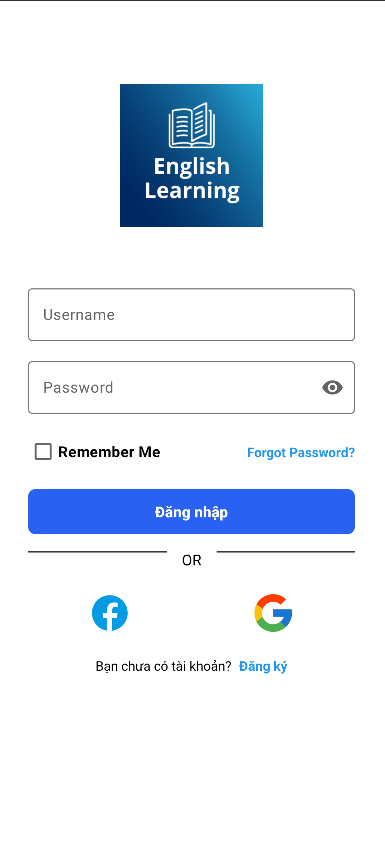 | 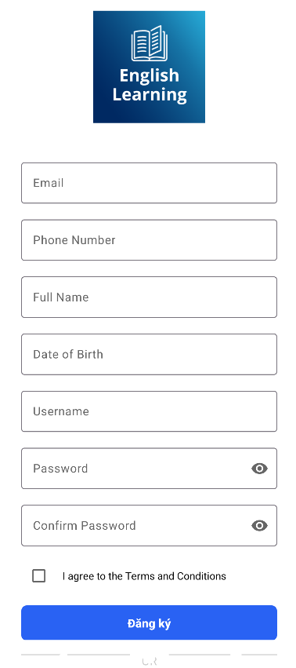 |

</div>

**Chức Năng:**

- ✅ Đăng nhập Email/Username
- ✅ Google Sign-In tích hợp
- ✅ Ghi nhớ đăng nhập (Remember Me)
- ✅ Quên mật khẩu (Forgot Password)
- ✅ Xác thực Firebase

#### 2️⃣ **Register Screen**

- 📝 Nhập Email
- 🔐 Mật khẩu & Xác nhận
- 👤 Thông tin cá nhân
- ✅ Xác thực tài khoản

#### 3️⃣ **Reset Password Screen**

- 📧 Nhập email
- 🔗 Gửi link reset
- 🔄 Tạo mật khẩu mới

---

### 🏠 **Màn Hình Chính (Main Home Screen)**

<div align="center">

|                  Giao diện Trang chủ 1                  |                  Giao diện Trang chủ 2                  |
| :-----------------------------------------------------: | :-----------------------------------------------------: |
| 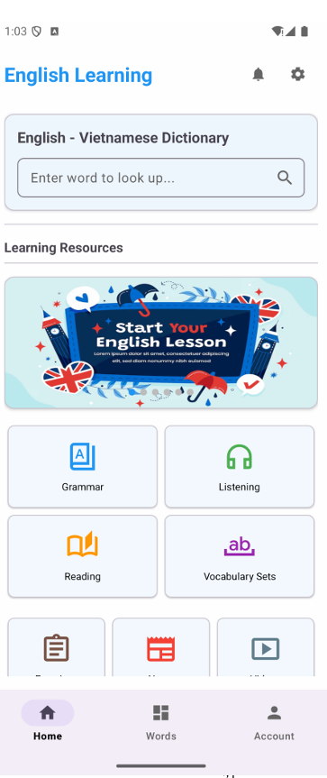 | 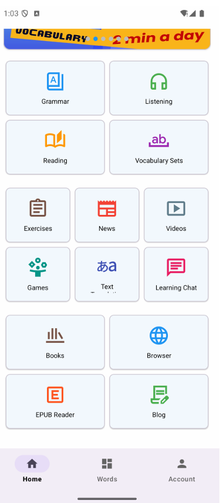 |

</div>

**Bottom Navigation Bar:**

- 🏠 **Home** - Menu chính với 15+ tính năng
- 📚 **Words** - Quản lý từ vựng cá nhân
- 👤 **Account** - Hồ sơ, cài đặt, thông báo

---

### 📚 **Mô-đul 1: Quản Lý Từ Vựng (Vocabulary)**

<div align="center">

|                           Từ vựng - Phần 1                            |                           Từ vựng - Phần 2                            |                           Từ vựng - Phần 3                            |
| :-------------------------------------------------------------------: | :-------------------------------------------------------------------: | :-------------------------------------------------------------------: |
| 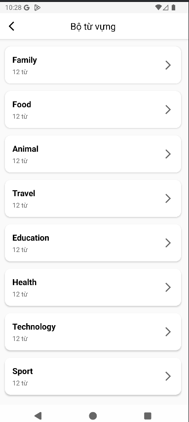 | 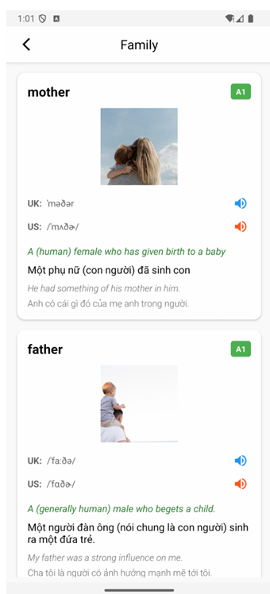 | 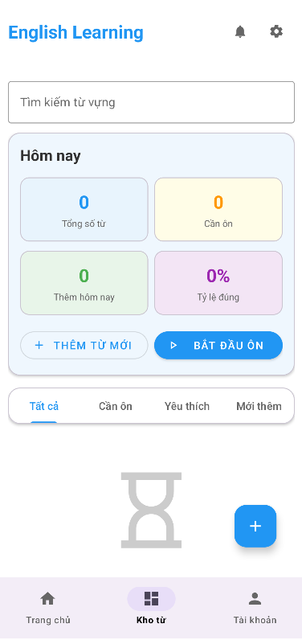 |

</div>
```

**Tính Năng Chi Tiết:**
| Chức Năng | Mô Tả |
|-----------|-------|
| **Thêm Từ** | Nhập từ, nghĩa, ví dụ, phát âm |
| **Chỉnh Sửa** | Cập nhật thông tin từ |
| **Xóa** | Xóa từ khỏi danh sách |
| **Xem Chi Tiết** | Định nghĩa, ví dụ, hình ảnh |
| **Ôn Tập** | Flashcard, trắc nghiệm từ |
| **Phân Loại** | Theo chủ đề, độ khó |
| **Yêu Thích** | Đánh dấu từ yêu thích |
| **Tìm Kiếm** | Tìm từ nhanh chóng |

**Fragment "Words Tab":**

- 📋 RecyclerView hiển thị từ vựng
- 🔍 Tìm kiếm real-time
- ➕ Nút thêm từ mới (AddWordActivity)
- 📊 Thống kê từ vựng

---

### 🎯 **Mô-đul 2: Bài Tập Ngữ Pháp (Grammar)**

<div align="center">
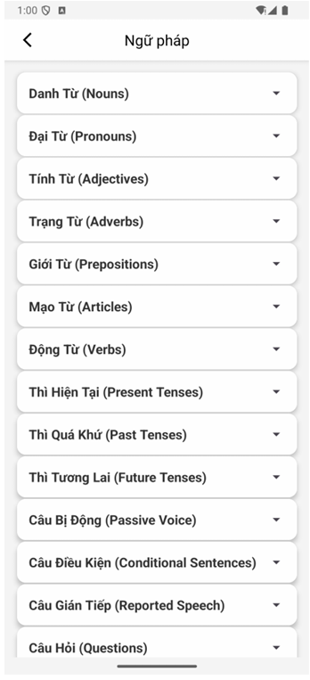
</div>

**Tính Năng Chi Tiết:**

| Chức Năng              | Mô Tả                               |
| ---------------------- | ----------------------------------- |
| **ExpandableListView** | Danh sách có thể mở rộng            |
| **Chi Tiết Bài**       | Giải thích quy tắc, ví dụ           |
| **Bài Tập**            | Câu hỏi trắc nghiệm, điền chỗ trống |
| **Video Hướng Dẫn**    | Link video YouTube                  |
| **Ghi Chú**            | Ghi chú cá nhân                     |

---

### 👂 **Mô-đul 3: Bài Nghe (Listening)**

<div align="center">

|                          Listening 1                          |                          Listening 2                          |
| :-----------------------------------------------------------: | :-----------------------------------------------------------: |
| 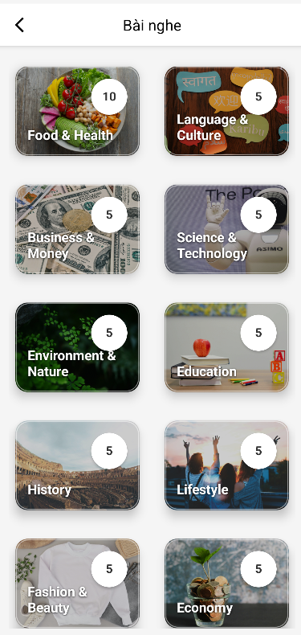 | 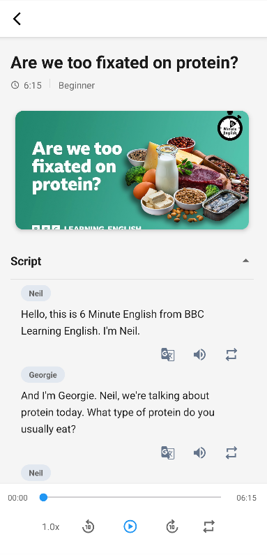 |

</div>

**Tính Năng:**

- 🎵 **Audio Player** - Play, pause, stop, seek
- 📝 **Transcript** - Phiên âm toàn bộ
- 🔤 **Vocabulary** - Từ vựng trong bài
- ❓ **Questions** - Bài tập trắc nghiệm
- 📊 **Score** - Lưu kết quả

---

### 📖 **Mô-đul 4: Bài Đọc Hiểu (Reading)**

<div align="center">

|                           Reading 1                            |                           Reading 2                            |                           Reading 3                            |
| :------------------------------------------------------------: | :------------------------------------------------------------: | :------------------------------------------------------------: |
|  | 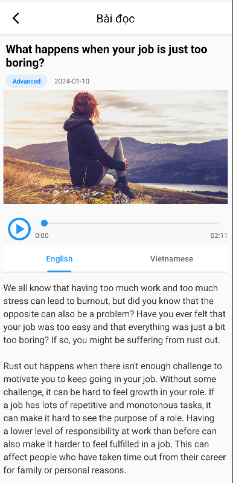 | 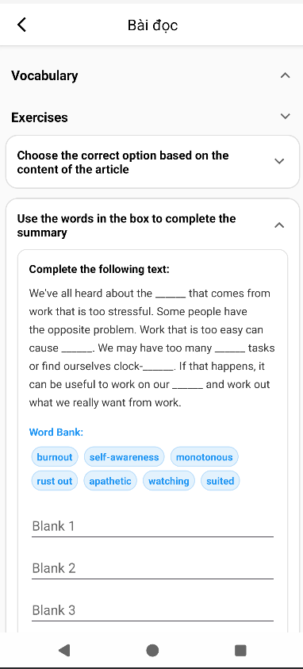 |

</div>

**Tính Năng:**

- 📄 **Bài Đọc** - Nội dung dạng text
- 🔤 **Vocabulary** - Từ vựng được highlight
- 📋 **Fill Blanks** - Điền chỗ trống
- 🎯 **Multiple Choice** - Câu hỏi trắc nghiệm
- 📊 **Progress** - Lưu tiến độ

---

### ✏️ **Mô-đul 5: Bài Tập (Exercises)**

<div align="center">

|                            Exercise 1                            |                            Exercise 2                            |                            Exercise 3                            |
| :--------------------------------------------------------------: | :--------------------------------------------------------------: | :--------------------------------------------------------------: |
| 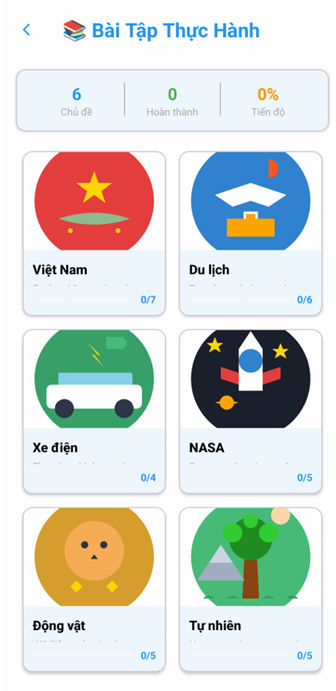 | 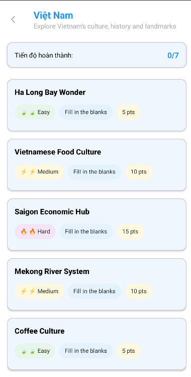 | 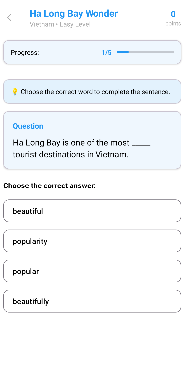 |

</div>

**Tính Năng:**

- ✏️ **Fill Blanks** - Điền chỗ trống, chia từ
- 🎯 **Multiple Choice** - Trắc nghiệm 4 đáp án
- 📖 **Reading Comprehension** - Đọc & trả lời
- 💾 **Save Progress** - Lưu kết quả
- 📊 **Score** - Hiển thị điểm số

---

### 🎮 **Mô-đul 6: Trò Chơi Tương Tác (Games)**

<div align="center">

|                          Game 1                          |                          Game 2                          |
| :------------------------------------------------------: | :------------------------------------------------------: |
| 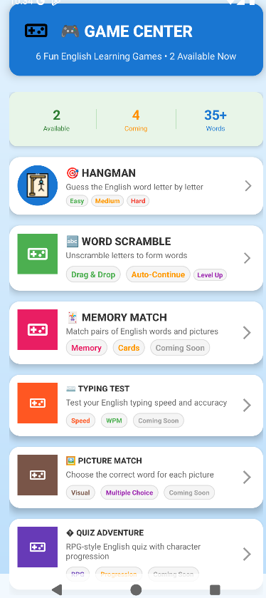 | 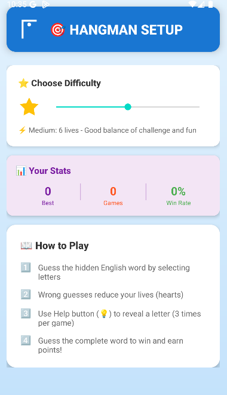 |

</div>

**Tính Năng Trò Chơi:**
| Trò Chơi | Cách Chơi | Điểm | Độ Khó |
|----------|-----------|------|--------|
| **Hangman** | Đoán chữ cái | 10/chữ | ⭐-⭐⭐⭐ |
| **Word Scramble** | Xếp chữ lại | 20/từ | ⭐⭐-⭐⭐⭐⭐ |

---

### 📰 **Mô-đul 7: Tin Tức Tiếng Anh (News)**

**Tính Năng:**

- 📰 **Danh sách tin tức** từ API
- 🔗 **Link bài gốc** - Đọc toàn bộ
- 💾 **Lưu bài viết** yêu thích
- 📤 **Chia sẻ** trên mạng xã hội
- 🔍 **Tìm kiếm** tin tức

---

### 🎥 **Mô-đul 8: Video Học Tập (Video)**

<div align="center">

</div>

**Tính Năng:**

- 🎬 **YouTube Player** tích hợp
- 📝 **Mô tả video** đầy đủ
- 📚 **Vocabulary** trong video
- 💬 **Bình luận**
- ⭐ **Rating** & **Views**

---

### 🌐 **Mô-đul 9: Dịch Song Ngữ (Bilingual)**

<div align="center">

|                     Tìm kiếm từ vựng                      |                            Dịch song ngữ                            |
| :-------------------------------------------------------: | :-----------------------------------------------------------------: |
| 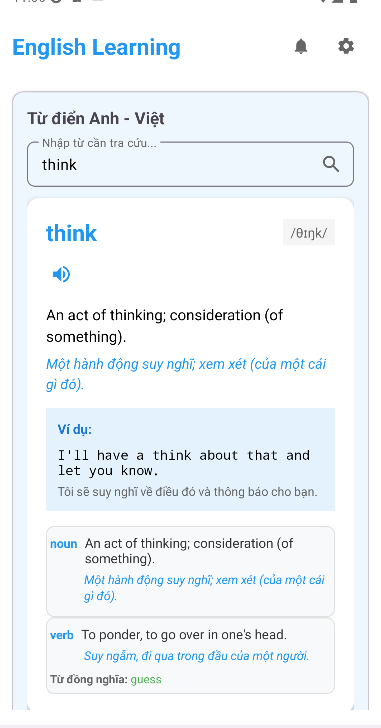 | 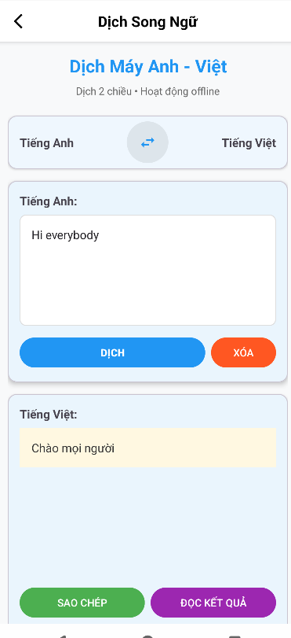 |

</div>

**Tính Năng:**

- 🌐 **Dịch tự động** Anh ↔ Việt
- 🔊 **Phát âm** - Text-to-speech
- 💾 **Lưu bản dịch** yêu thích
- 📤 **Chia sẻ** kết quả dịch
- 🕐 **Lịch sử dịch**
- 🔗 **API dịch** Google Translate

---

### 🌐 **Mô-đul 10: Chatbot**

<div align="center">
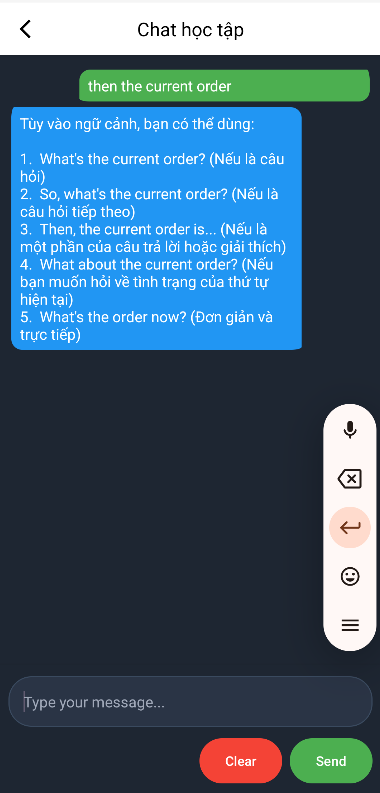
</div>

### 📖 **Các Mô-đul Bổ Sung**

| Mô-đul          | Tính Năng Chính                               | Biểu Tượng |
| --------------- | --------------------------------------------- | ---------- |
| **Dictionary**  | Từ điển chi tiết, định nghĩa, ví dụ, hình ảnh | 📖         |
| **Blog**        | Bài viết blog tiếng Anh, tips học             | ✍️         |
| **Book**        | Sách điện tử, truyện tiếng Anh                | 📕         |
| **EPUB Reader** | Đọc file EPUB, highlight từ vựng              | 📄         |
| **Chat**        | Hỏi đáp, chat tương tác                       | 💬         |
| **Browser**     | Trình duyệt web tích hợp                      | 🌐         |

---

### ⚙️ **Màn Hình Cài Đặt & Tài Khoản (Settings & Account)**

<div align="center">

|                           Account                           |                          Settings                           |                            Edit Profile                             |                          Upgrade Pro                           |                              Notifications                              |
| :---------------------------------------------------------: | :---------------------------------------------------------: | :-----------------------------------------------------------------: | :------------------------------------------------------------: | :---------------------------------------------------------------------: |
| 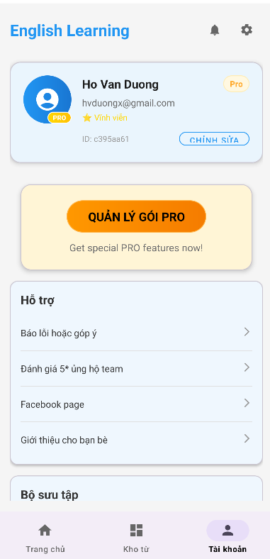 | 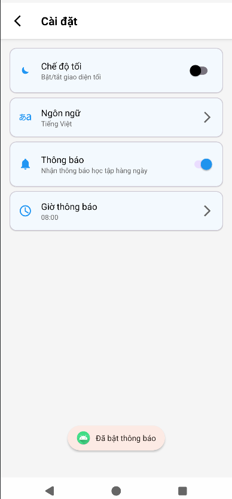 | 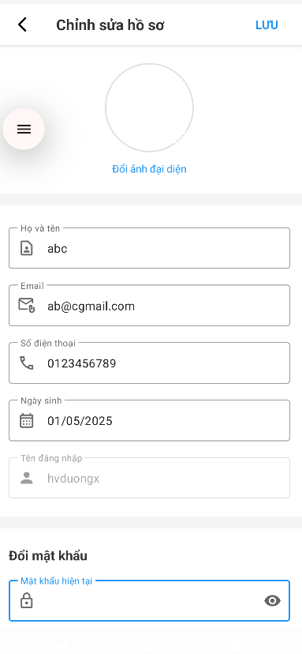 | 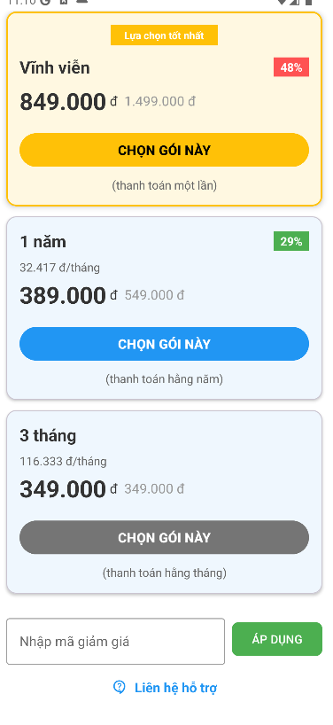 | 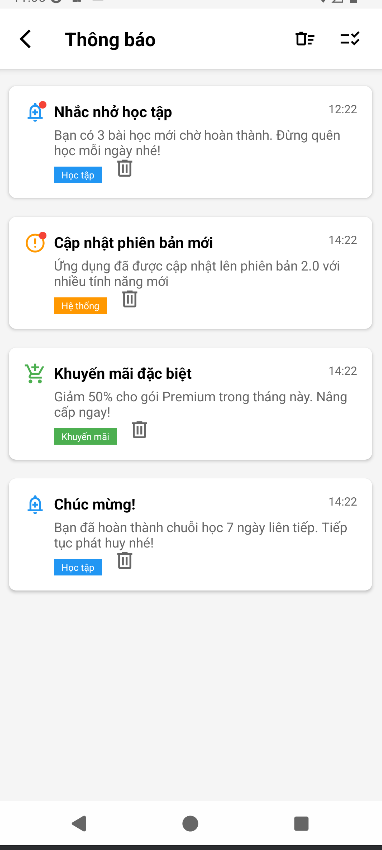 |

</div>

---

## 🛠️ Công Nghệ & Stack Công Nghệ

### **Backend & Cloud**

```
🔥 Firebase Suite:
  ✅ Authentication (Email, Google Sign-In)
  ✅ Firestore NoSQL Database (Documents)
  ✅ Realtime Database (JSON)
  ✅ Cloud Messaging (FCM Push Notifications)
  ✅ Firebase Analytics
  ✅ Cloud Storage (Media Files)

📡 External APIs:
  ✅ News API (Tin tức)
  ✅ Dictionary API (Định nghĩa từ)
  ✅ Google Translate API (Dịch)
  ✅ Google ML Kit (OCR, Text Recognition)
  ✅ YouTube Data API (Video)
  ✅ Unsplash API (Hình ảnh)
```

### **Frontend & UI**

```
📱 Android Framework:
  ✅ AndroidX (Jetpack)
  ✅ Material Design 3
  ✅ Constraint Layout
  ✅ RecyclerView
  ✅ ExpandableListView
  ✅ ViewPager 2
  ✅ Bottom Navigation

🎨 UI Libraries:
  ✅ Material Components
  ✅ CardView
  ✅ FlexBoxLayout
  ✅ CircleImageView
  ✅ SwipeRefreshLayout
```

### **Architecture & Patterns**

```
🏗️ MVVM Architecture:
  ✅ Model (Data Layer)
  ✅ View (UI Layer)
  ✅ ViewModel (Business Logic)
  ✅ Repository (Data Access)

📐 Design Patterns:
  ✅ Adapter Pattern (RecyclerView)
  ✅ Observer Pattern (LiveData)
  ✅ Singleton (Firebase, APIs)
  ✅ Factory Pattern
```

### **Networking & Data**

```
🌐 HTTP & REST:
  ✅ Retrofit 2 (REST Client)
  ✅ OkHttp 3 (HTTP Interceptor)
  ✅ Logging Interceptor (Debug)

📦 Serialization:
  ✅ Gson (JSON)
  ✅ SimpleXML (XML)
  ✅ Protocol Buffers
```

### **Media & Rich Content**

```
🎬 Media:
  ✅ ExoPlayer (Video Playback)
  ✅ YouTube Player SDK
  ✅ MediaPlayer (Audio)
  ✅ Glide (Image Loading & Caching)

📖 Document:
  ✅ EPUB Reader Library
  ✅ WebView (HTML Content)
```

### **Security**

```
🔐 Authentication & Encryption:
  ✅ Firebase Authentication
  ✅ Google Sign-In (OAuth 2.0)
  ✅ BCrypt (Password Hashing)
  ✅ SharedPreferences Encryption

💳 Payment:
  ✅ VNPay Integration
  ✅ SSL/TLS (Secure Communication)
```

### **Testing & QA**

```
🧪 Testing:
  ✅ JUnit 4 (Unit Tests)
  ✅ Espresso (UI Tests)
  ✅ Mockito (Mocking)
  ✅ MockWebServer (API Mocking)
```

### **Build & Deployment**

```
🔨 Build Tools:
  ✅ Gradle 8.x
  ✅ Android Gradle Plugin
  ✅ ProGuard (Obfuscation)
  ✅ D8 (DEX Compiler)

📦 Packaging:
  ✅ APK Signing
  ✅ App Bundle (Play Store)
  ✅ Dynamic Delivery
```

### **Dependencies Version**

```gradle
// Build Config
compileSdk = 36
targetSdk = 36
minSdk = 24
sourceCompatibility = JavaVersion.VERSION_11
targetCompatibility = JavaVersion.VERSION_11

// Key Libraries
Firebase BoM (Latest)
AndroidX (Latest Stable)
Retrofit 2.10.0
OkHttp 4.11.0
Glide 4.16.0
Material Components 1.10.0
```

---

## 📁 Cấu Trúc Chi Tiết Dự Án

### **Package Structure**

```
com.example.englishlearningapp/
│
├── view/ (UI Layer - Activities & Fragments)
│   ├── activity/
│   │   ├── BaseActivity.java              # Base class cho tất cả activity
│   │   ├── MainActivity.java              # Main screen với bottom nav
│   │   ├── LoginActivity.java             # Đăng nhập
│   │   ├── RegisterActivity.java          # Đăng ký
│   │   ├── ResetPasswordActivity.java     # Reset mật khẩu
│   │   ├── EditProfileActivity.java       # Chỉnh sửa hồ sơ
│   │   ├── SettingsActivity.java          # Cài đặt
│   │   ├── UpgradeProActivity.java        # Nâng cấp pro
│   │   ├── NotificationsActivity.java     # Thông báo
│   │   ├── AddWordActivity.java           # Thêm từ vựng
│   │   ├── WordDetailActivity.java        # Chi tiết từ
│   │   └── WordReviewActivity.java        # Ôn tập từ
│   │
│   ├── fragment/
│   │   ├── HomeFragment.java              # Tab Home
│   │   ├── WordFragment.java              # Tab Words
│   │   └── AccountFragment.java           # Tab Account
│   │
│   ├── features_home/ (Features trong Tab Home)
│   │   ├── vocabulary/
│   │   │   ├── VocabularyActivity.java
│   │   │   ├── VocabularyDetailActivity.java
│   │   │   ├── VocabularyAdapter.java
│   │   │   ├── Vocabulary.java (Model)
│   │   │   └── TopicVocabulary.java (Model)
│   │   │
│   │   ├── grammar/
│   │   │   ├── GrammarActivity.java
│   │   │   ├── DetailGrammarActivity.java
│   │   │   ├── GrammarAdapter.java
│   │   │   ├── TopicGrammar.java (Model)
│   │   │   └── SubItemGrammar.java (Model)
│   │   │
│   │   ├── listening/
│   │   │   ├── ListeningActivity.java
│   │   │   ├── ArticleListeningActivity.java
│   │   │   ├── ContentSegmentListening.java
│   │   │   ├── QuestionListening.java (Model)
│   │   │   └── TopicListeningAdapter.java
│   │   │
│   │   ├── reading/
│   │   │   ├── ReadingActivity.java
│   │   │   ├── ArticleReadingDetailActivity.java
│   │   │   ├── ArticleReading.java (Model)
│   │   │   ├── ExerciseReading.java (Model)
│   │   │   └── MultipleChoiceQuestion.java (Model)
│   │   │
│   │   ├── exercises/
│   │   │   ├── ExerciseActivity.java
│   │   │   ├── ExerciseDetailActivity.java
│   │   │   ├── FillBlanksActivity.java
│   │   │   ├── Exercise.java (Model)
│   │   │   └── ExerciseManager.java
│   │   │
│   │   ├── game/
│   │   │   ├── GameActivity.java
│   │   │   ├── GameListActivity.java
│   │   │   ├── GameSettingsActivity.java
│   │   │   ├── HangmanActivity.java
│   │   │   ├── WordScrambleActivity.java
│   │   │   └── ScoreManager.java
│   │   │
│   │   ├── news/
│   │   │   ├── NewsActivity.java
│   │   │   ├── NewsDetailActivity.java
│   │   │   ├── NewsAdapter.java
│   │   │   ├── NewsItem.java (Model)
│   │   │   ├── NewsApiService.java
│   │   │   └── ApiClientNews.java
│   │   │
│   │   ├── video/
│   │   │   ├── VideoActivity.java
│   │   │   ├── VideoAdapter.java
│   │   │   ├── VideoItem.java (Model)
│   │   │   ├── VideoViewModel.java
│   │   │   └── VideoRepository.java
│   │   │
│   │   ├── bilingual/
│   │   │   ├── BilingualActivity.java
│   │   │   └── TranslationHelper.java
│   │   │
│   │   ├── dictionary/
│   │   │   ├── ApiDictionaryClient.java
│   │   │   ├── DictionaryRepository.java
│   │   │   ├── DictionaryResponse.java
│   │   │   ├── Definition.java
│   │   │   ├── Meaning.java
│   │   │   └── Phonetic.java
│   │   │
│   │   ├── blog/
│   │   │   └── BlogActivity.java
│   │   │
│   │   ├── book/
│   │   │   └── BookActivity.java
│   │   │
│   │   ├── epub/
│   │   │   └── EpubActivity.java
│   │   │
│   │   ├── browser/
│   │   │   └── BrowserActivity.java
│   │   │
│   │   └── chat/
│   │       ├── ChatActivity.java
│   │       ├── MessageChat.java (Model)
│   │       ├── MessageChatDAO.java
│   │       └── ApiChatService.java
│   │
│   └── adapter/
│       ├── ViewPagerAdapter.java
│       └── (Các adapter khác)
│
├── data/ (Data Layer - Repository, API, Database)
│   ├── dao/
│   │   ├── UserDAO.java
│   │   ├── VocabularyDAO.java
│   │   └── (Các DAO khác)
│   │
│   ├── repository/
│   │   ├── UserRepository.java
│   │   ├── VocabularyRepository.java
│   │   ├── NewsRepository.java
│   │   └── (Các repository khác)
│   │
│   ├── model/
│   │   ├── User.java
│   │   ├── Word.java
│   │   └── (Các model khác)
│   │
│   ├── api/
│   │   ├── RetrofitClient.java
│   │   ├── ApiService.java
│   │   └── (Các API service)
│   │
│   └── database/
│       ├── AppDatabase.java (Room)
│       └── (Các entity khác)
│
├── util/ (Utilities)
│   ├── PasswordUtils.java
│   ├── DateUtils.java
│   ├── FileUtils.java
│   └── (Các utility khác)
│
├── utils/ (Common Utils)
│   ├── Constants.java
│   ├── SharedPreferencesUtil.java
│   └── (Các util khác)
│
└── payment/ (Payment Module - VNPay)
    ├── VNPayManager.java
    ├── PaymentCallback.java
    └── TransactionManager.java
```

### **Resource Structure**

```
res/
├── layout/
│   ├── activity_*.xml        # Activities (50+ files)
│   ├── fragment_*.xml        # Fragments (3 files)
│   ├── item_*.xml            # RecyclerView items
│   └── list_*.xml            # Lists
│
├── drawable/
│   ├── ic_home.xml
│   ├── ic_word.xml
│   ├── ic_account.xml
│   ├── ic_notifications.xml
│   ├── ic_settings.xml
│   └── (Icons & images)
│
├── menu/
│   ├── bottom_nav_menu.xml
│   └── (Menus)
│
├── values/
│   ├── strings.xml           # String resources
│   ├── colors.xml            # Color definitions
│   ├── styles.xml            # App styles
│   ├── dimens.xml            # Dimensions
│   └── arrays.xml            # Array resources
│
├── values-night/
│   ├── colors.xml            # Dark mode colors
│   └── styles.xml            # Dark mode styles
│
├── values-xx-rXX/
│   └── strings.xml           # Translations
│
└── xml/
    ├── backup_rules.xml
    ├── data_extraction_rules.xml
    └── (Config XMLs)
```

### **Assets Structure**

```
assets/
├── vocabulary/
│   └── vocabulary.json       # Từ vựng dạng JSON
├── grammar/
│   └── grammar.json          # Ngữ pháp dạng JSON
├── listening/
│   └── (Audio files)
└── (Các tài nguyên khác)
```

---

## 📊 Kiến Trúc Ứng Dụng

### **MVVM Architecture Pattern**

<div align="center">
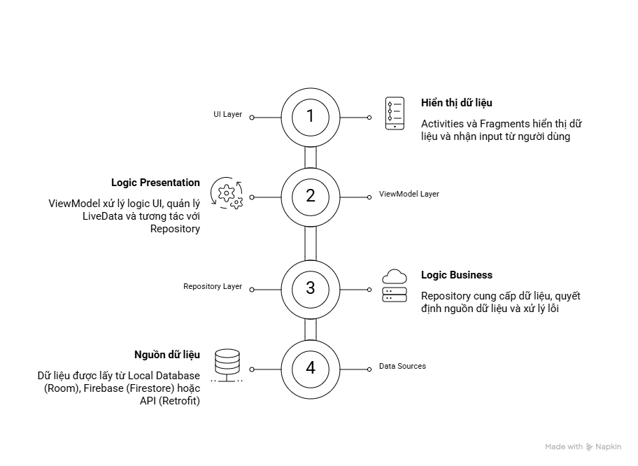
</div>

### **Data Flow: Login**

<div align="center">
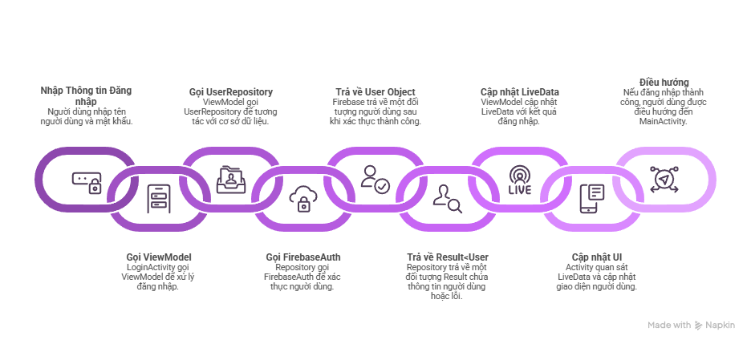
</div>

---

## 📖 Hướng Dẫn Cài Đặt & Chạy

### **Yêu Cầu Hệ Thống**

```
✅ Android Studio: 2023.2 hoặc mới hơn
✅ JDK: Java 11 trở lên
✅ Android SDK: API 24 - 36
✅ Gradle: 8.x
✅ RAM: 8GB (khuyến nghị 16GB)
✅ Disk: 5GB+ (Android SDK + Emulator)
✅ OS: Windows 10+, macOS 10.15+, Linux Ubuntu 20.04+
```

### **Step 1: Clone & Setup Dự Án**

```bash
# Clone repository
git clone https://github.com/yourusername/EnglishLearningApp.git
cd EnglishLearningApp

# Mở trong Android Studio
# File → Open → Chọn thư mục dự án

# Gradle Sync (tự động hoặc manual)
# File → Sync Now
# Hoặc từ terminal: ./gradlew sync
```

### **Step 2: Firebase Setup**

```bash
# 1. Tạo dự án Firebase
https://console.firebase.google.com/

# 2. Tạo ứng dụng Android:
   - Package Name: com.example.englishlearningapp
   - Lấy SHA-1 fingerprint:
     ./gradlew signingReport

# 3. Download google-services.json
   → Đặt vào: app/google-services.json

# 4. Thiết lập Firebase:
   ✅ Authentication (Email, Google)
   ✅ Firestore Database
   ✅ Realtime Database (nếu cần)
   ✅ Cloud Messaging (FCM)
   ✅ Storage (cho avatar, media)
```

### **Step 3: Google Sign-In Setup**

```bash
# 1. Vào Google Cloud Console
https://console.cloud.google.com/

# 2. Tạo OAuth 2.0 Client ID:
   - Type: Android
   - Package Name: com.example.englishlearningapp
   - SHA-1: (từ gradlew signingReport)

# 3. Copy Client ID → google_services.json
```

### **Step 4: VNPay Integration (Optional)**

```bash
# Cấu hình trong PaymentModule:
   - Merchant Code: [Your Merchant Code]
   - Return URL: myapp://vnpay_return
   - Thêm intent filter trong AndroidManifest.xml
```

### **Step 5: Build & Run**

```bash
# Build APK Debug
./gradlew assembleDebug

# Chạy trên emulator/device
# Android Studio: Run → Run 'app'
# Hoặc: ./gradlew installDebug

# Build APK Release
./gradlew assembleRelease
# APK output: app/build/outputs/apk/release/app-release.apk
```

### **Step 6: Chạy Tests**

```bash
# Unit Tests
./gradlew test

# Instrumented Tests (trên device)
./gradlew connectedAndroidTest

# Specific test class
./gradlew test -Dtest=LoginActivityTest
```

---

## 🔐 Bảo Mật & Best Practices

### **Implemented Security**

```
✅ Firebase Authentication
✅ Google OAuth 2.0 Sign-In
✅ BCrypt Password Hashing
✅ SSL/TLS (HTTPS)
✅ ProGuard Obfuscation
✅ Firebase Security Rules
✅ Secure SharedPreferences
✅ Certificate Pinning (OkHttp)
```

### **Security Checklist**

- [ ] Update Firebase BoM
- [ ] Enable Firebase Security Rules
- [ ] Review Android Manifest Permissions
- [ ] Check for CVEs in dependencies
- [ ] Test on multiple Android versions
- [ ] Enable Data Backup Rules
- [ ] Use ProGuard Mapping Upload
- [ ] Implement Rate Limiting (API calls)
- [ ] Review Code untuk hardcoded secrets

---

## 📊 Dependency Management

### **Key Dependencies**

```gradle
// Firebase
implementation platform(libs.firebase.bom)
implementation libs.firebase.auth
implementation libs.firebase.firestore
implementation libs.firebase.messaging
implementation libs.firebase.analytics

// AndroidX & Material
implementation libs.appcompat
implementation libs.material
implementation libs.lifecycle.viewmodel
implementation libs.lifecycle.livedata

// Networking
implementation libs.retrofit
implementation libs.okhttp
implementation libs.logging.interceptor
implementation libs.gson

// UI
implementation libs.glide
implementation libs.circleimageview
implementation libs.flexbox

// ML Kit
implementation libs.translate
implementation libs.play.services.mlkit.text.recognition

// Testing
testImplementation libs.junit
androidTestImplementation libs.espresso.core
```

### **Version Management**

```gradle
// Tất cả versions trong:
gradle/libs.versions.toml

[versions]
compileSdk = "36"
targetSdk = "36"
minSdk = "24"
javaVersion = "VERSION_11"

// Update command:
./gradlew dependencyUpdates
```

---

## 🐛 Troubleshooting

### **Build Issues**

| Lỗi                           | Giải Pháp                                  |
| ----------------------------- | ------------------------------------------ |
| **Gradle Sync Failed**        | `./gradlew clean sync`                     |
| **Cannot find symbol**        | Invalidate cache: File → Invalidate Caches |
| **Firebase Connection Error** | Verify google-services.json path           |
| **APK Size Large**            | Enable ProGuard/R8                         |
| **Memory Error**              | Increase Gradle heap: `-Xmx2048m`          |

### **Runtime Issues**

| Lỗi                      | Giải Pháp                        |
| ------------------------ | -------------------------------- |
| **App Crashes on Start** | Check logcat, Firebase setup     |
| **Navigation Errors**    | Verify intents, activity names   |
| **Data Not Syncing**     | Check Firebase rules, internet   |
| **Images Not Loading**   | Verify Glide caching, paths      |
| **Payment Not Working**  | Check VNPay config, test account |

---

## 📈 Performance Optimization

```
🚀 Memory:
  ✅ Use ViewBinding instead of findViewById
  ✅ Implement pagination (RecyclerView)
  ✅ Use Glide caching
  ✅ Release resources in onDestroy

📶 Network:
  ✅ Implement caching strategy
  ✅ Use OkHttp interceptor
  ✅ Batch API calls
  ✅ Compress images

💾 Storage:
  ✅ Clear cache periodically
  ✅ Use ProGuard
  ✅ Optimize APK size
  ✅ Use Android App Bundle
```

---

## 👥 Team & Contact

- **Developer:** star duong
- **Email:** hvduong2392k4@gmail.com
- **Project:** English Learning App

---

## 🔗 Useful Resources

| Resource            | Link                                  |
| ------------------- | ------------------------------------- |
| **Android Docs**    | https://developer.android.com         |
| **Firebase Docs**   | https://firebase.google.com/docs      |
| **Material Design** | https://material.io                   |
| **MVVM Guide**      | https://developer.android.com/jetpack |
| **Retrofit Docs**   | https://square.github.io/retrofit     |

---

## 📊 Project Statistics

| Metric               | Value                   |
| -------------------- | ----------------------- |
| **Min SDK**          | 24 (Android 7.0)        |
| **Target SDK**       | 36 (Android 15)         |
| **Java Version**     | 11                      |
| **Total Activities** | 12                      |
| **Total Fragments**  | 3                       |
| **Total Modules**    | 15+                     |
| **Layout Files**     | 60+                     |
| **Lines of Code**    | ~50,000+                |
| **Architecture**     | MVVM                    |
| **Backend**          | Firebase + REST APIs    |
| **Database**         | Firestore + Realtime DB |

---

<div align="center">

### ⭐ If you find this project helpful, please give it a star! ⭐

Made with ❤️ by Star

**Happy Learning! 📚🚀**

</div>
